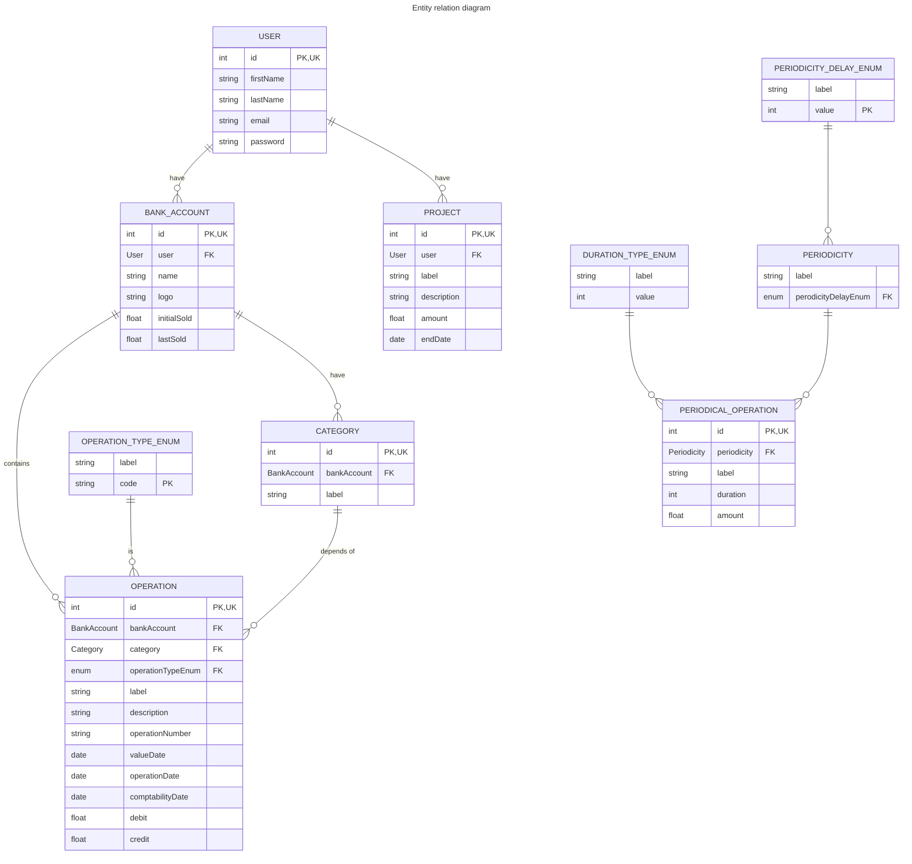
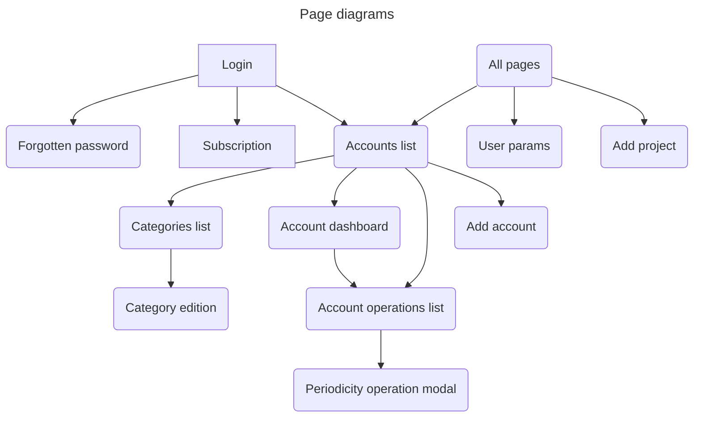

# Application structure




Code architecture

```ultree
      RootFolder
          src
              Shared
              Security
                  Presentation
                  Business
                  Infrastructure
              BankAccount
                  BankAccount
                      Presentation
                      Business
                      Infrastructure
                  Operation
                      Presentation
                      Business
                      Infrastructure
              Category
                  Presentation
                  Business
                  Infrastructure
              Periodicity
                  Presentation
                  Business
                  Infrastructure
              Project
                  Presentation
                  Business
                  Infrastructure
```